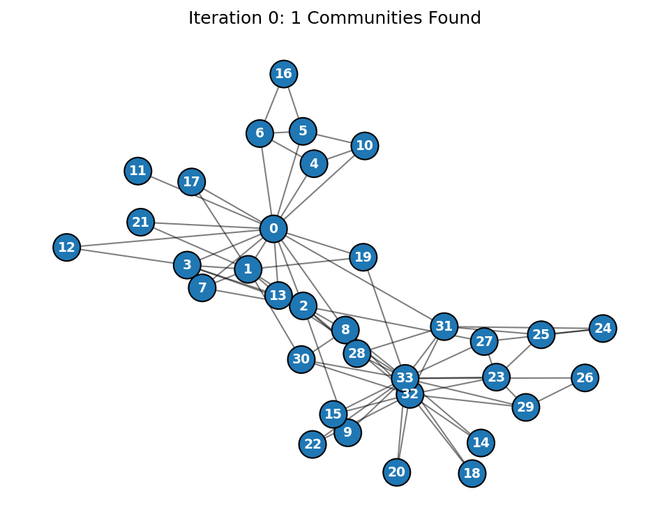
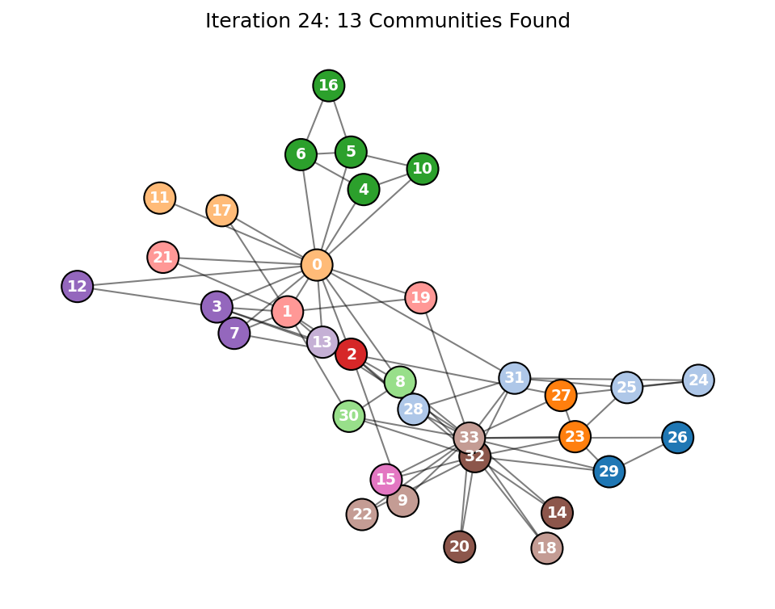
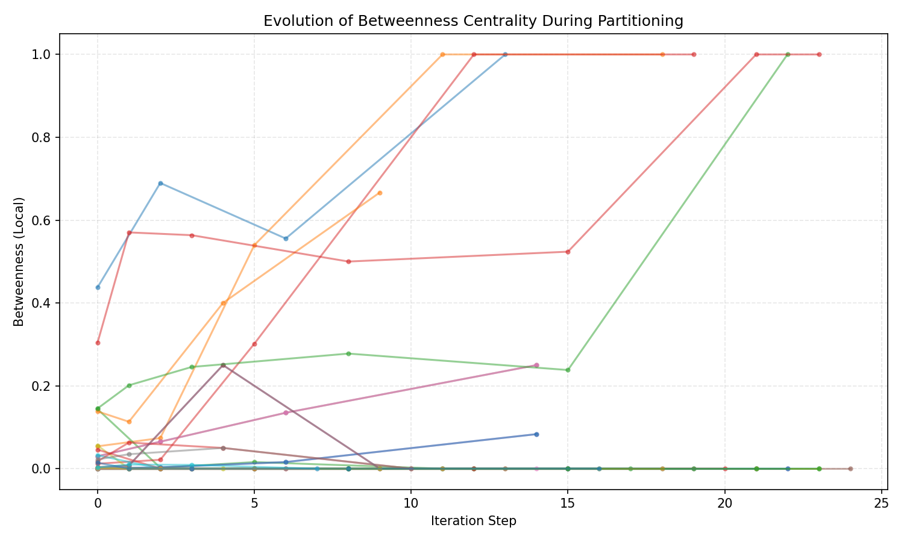

# Spectral Modularity Optimization: Recursive Bisection on the Karate Club Graph
Author: Avinash Kumar Thakur


## Project Overview
This project implements a **Recursive Spectral Bisection** algorithm to detect community structures within complex networks. Using **Zachary's Karate Club** dataset as a benchmark, the algorithm maximizes the **Modularity Score ($Q$)** to mathematically partition the graph into subgroups without prior knowledge of ground truth labels.

This implementation focuses on the intersection of **Linear Algebra** and **Network Theory**, specifically leveraging the spectral properties of the Modularity Matrix to identify latent social fractures.

## Mathematical Foundation
The core of this project relies on the **Modularity Matrix ($B$)**, defined as:

$$B_{ij} = A_{ij} - \frac{k_i k_j}{2m}$$

Where:
- $A_{ij}$ is the Adjacency Matrix (1 if connected, 0 otherwise).
- $k_i, k_j$ are the degrees of nodes $i$ and $j$.
- $m$ is the total number of edges.

The algorithm utilizes the **Leading Eigenvector** of this matrix to perform optimal graph partitioning, analogous to finding energy minimization states in physical systems.

### Algorithm Methodology
1.  **Eigen-Decomposition:** Compute the leading eigenvector of $B$ for the active subgraph.
2.  **Spectral Partitioning:** Split nodes based on the sign of the eigenvector components ($\vec{u}_i > 0$ vs $\vec{u}_i < 0$).
3.  **Recursive Refinement:** The process repeats recursively for each community until the leading eigenvalue $\lambda \le 0$, indicating that no further modularity gain is possible.

## Results & Analysis
The algorithm successfully fractured the network into **13 distinct micro-communities**, revealing fine-grained social structures beyond the primary binary split.

### Key Observations from Execution:
- **Primary Fracture (Iter 0):** The network immediately split into two major groups of size **18** and **16** with a massive modularity eigenvalue of **17.1083**. This perfectly captures the historical "Mr. Hi" vs. "Officer" conflict.
- **Energy Minimization:** The eigenvalue (modularity gain) systematically decreased with each split (`17.1` $\to$ `7.8` $\to$ `3.7` $\to$ `0.4`), confirming the physics-inspired optimization logic.
- **Convergence:** The recursion naturally terminated when the leading eigenvalue approached zero, preventing forced overfitting.

### Final Partition Distribution
The analysis identified the following stable sub-cliques:
> `[26, 29]`, `[24, 25, 28, 31]`, `[23, 27]`, `[0, 11, 17]`, `[4, 5, 6, 10, 16]`, `[8, 30]`, `[2]`, `[1, 19, 21]`, `[3, 7, 12]`, `[13]`, `[14, 20, 32]`, `[9, 18, 22, 33]`, `[15]`

## Visual Output

### 1. Network Evolution
The algorithm generates visualization states for every iteration. 

**Iteration 0 (Primary Split):**
Here we see the clear emergence of the two main factions.


**Iteration 24 (Final State):**
The final stable state with 13 detected micro-communities.


### 2. Metric Tracking
We tracked **Betweenness Centrality** throughout the process. High betweenness nodes act as bridges; as the graph fractures, these values shift, highlighting the changing topology.


## Repository Contents
- `main.py`: Core recursive algorithm, linear algebra computations, and visualization logic.
- `analysis.ipynb`: Interactive Jupyter Notebook for step-by-step analysis.
- `outputs/`: Directory containing generated community plots and JSON results.
- `final_communities.json`: The raw output data of the node partitions.
- `requirements.txt`: Python dependencies.

## Academic Context
This project was developed as part of the **Graph Theory & Network Analysis** curriculum at **IISER Thiruvananthapuram**.

**Supervisor:** Dr. Saptarishi Bej  
**Course:** DSC212 (Graph Theory Module)

## Usage
To reproduce the analysis:

```bash
# 1. Install dependencies
pip install -r requirements.txt

# 2. Run the script
python main.py
